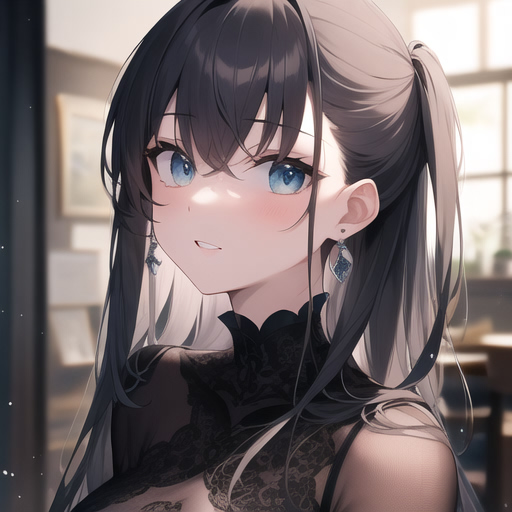
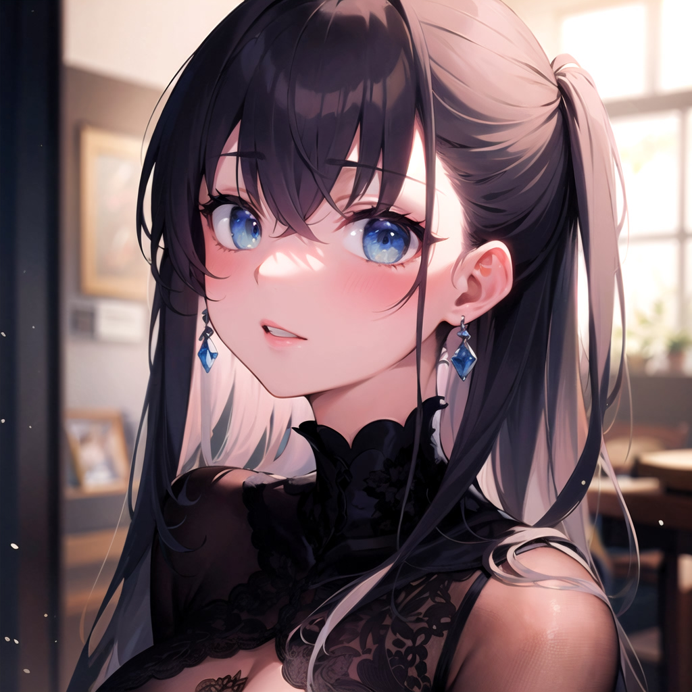
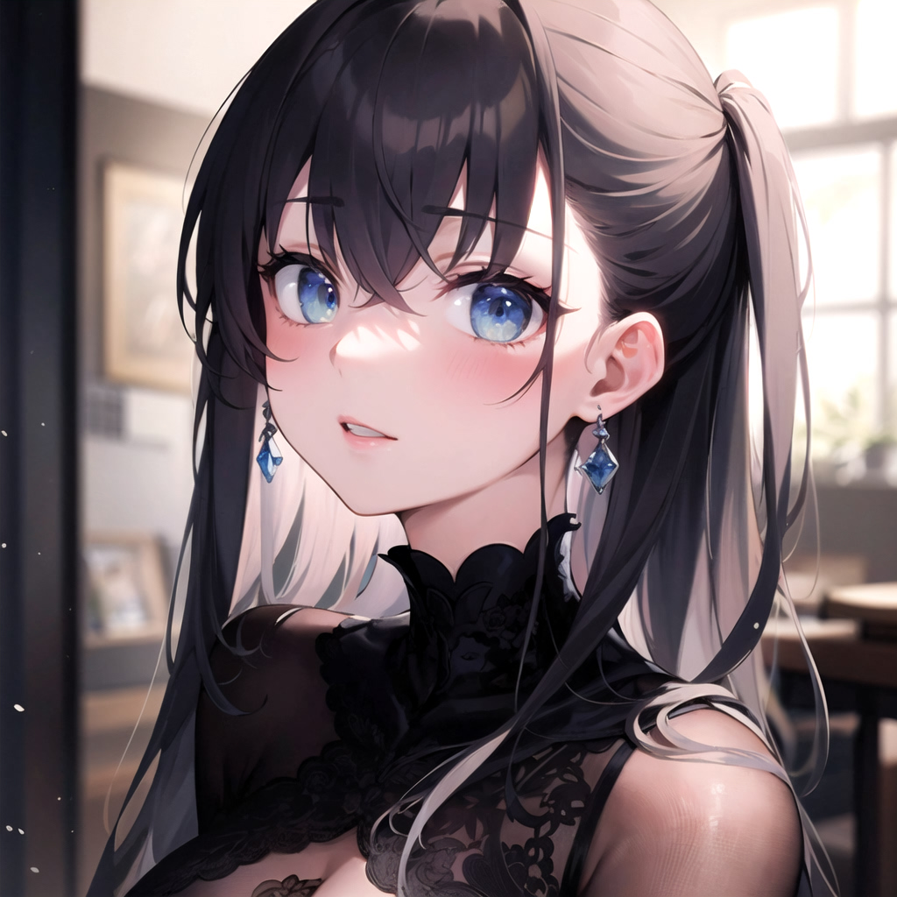
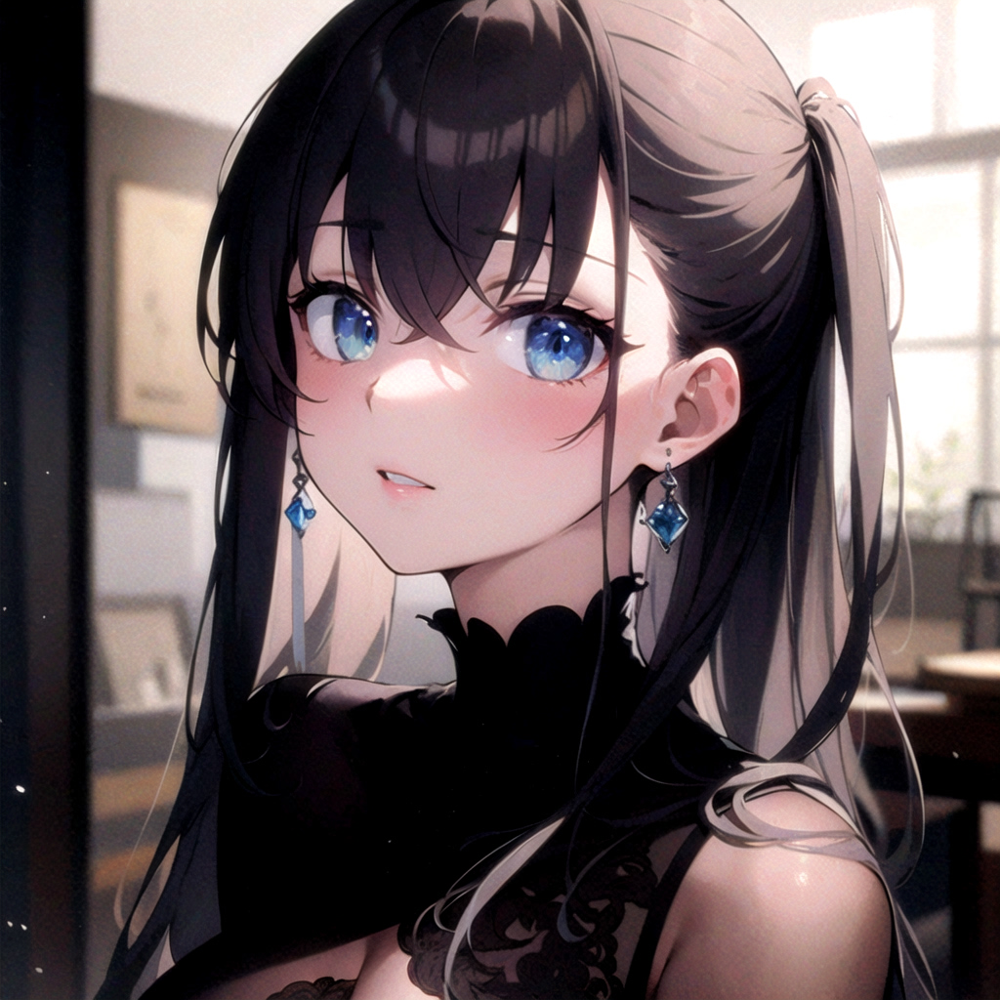

<h1 align="center">No Longer Maintained</h1>

Please check out the new and improved <a href = "https://github.com/Haoming02/sd-webui-vectorscope-cc">Vectorscope CC</a>!

This repo will no longer receive updates...

# SD Webui Dynamic HDR
This is an Extension for the [Automatic1111 Webui](https://github.com/AUTOMATIC1111/stable-diffusion-webui), which *tries to* enhance the **img2img** upscale quality.

## What is This ?
I came up with a ~~convoluted~~ way to *slightly* enhances the **img2img** process 
by artificially adding in some noise to retain some of the "texture" during upscale, 
and offsetting said noise based on the brightness of the input image, to further increase the contrast.[^1] 
On top of that, since this process happens **before** the Stable Diffusion pipeline, 
this can take advantage of the diffusion process and generate even better results rather than being just a simple filter.

## How to Use ?
After installing this Extension, you can see its sub-section in the **img2img** tab. 
The default parameters can already yield some decent results.
Refer to the table below and play around with the values.

#### Parameters
- **Steps:** How many times does it apply the noises
- **Brightness:** Offset the bounds of the luminance map
- **Contrast:** The upper and lower bounds of the luminance map
- **Saturation:** Alter the saturation of the input image
- **Power:** Use `Power` instead of `Multiplication` calculation for saturation modification; Lower **Saturation** if you enable this
- **Bloom:** Zero the lower bound, so only the upper bound is processed; Increase **Blur** for better effects
- **Grey:** Generate a grey-scale instead of a full-color noise map
- **Sigma:** Affects how much noise is applied; Set to 0 to turn this Extension into just a basic Filter
- **Blur:** How strong should the luminance map be blurred
- **Debug:** When enabled, attach the intermediate steps to output

## Sample Images
> Base Image 512x512; img2img to 1024x1024; Same prompts; Same seed; Same settings

<table>
    <tbody>
        <tr align="center">
            <td>Base Image</td>
            <td>Without Ext.</td>
        </tr>
        <tr align="center">
            <td></td>
            <td></td>
        </tr>
    </tbody>
</table>

<table>
    <tbody>
        <tr align="center">
            <td><b>\</b></td>
            <td>a</td>
            <td>b</td>
            <td>c</td>
            <td>d</td>
            <td>e</td>
        </tr>
        <tr align="center">
            <td><b>Steps</b></td>
            <td>1</td>
            <td>2</td>
            <td>4</td>
            <td>8</td>
            <td>16</td>
        </tr>
        <tr align="center">
            <td><b>Brightness</b></td>
            <td>4</td>
            <td>2</td>
            <td>3</td>
            <td>-1</td>
            <td>1</td>
        </tr>
        <tr align="center">
            <td><b>Contrast</b></td>
            <td>4</td>
            <td>2</td>
            <td>3</td>
            <td>2</td>
            <td>1</td>
        </tr>
        <tr align="center">
            <td><b>Saturation</b></td>
            <td>1.5</td>
            <td>1.0</td>
            <td>1.5</td>
            <td>1.0</td>
            <td>1.2</td>
        </tr>
        <tr align="center">
            <td><b>Sigma</b></td>
            <td>1.0</td>
            <td>1.0</td>
            <td>1.0</td>
            <td>2.0</td>
            <td>0.5</td>
        </tr>
        <tr align="center">
            <td><b>Blur</b></td>
            <td>64</td>
            <td>16</td>
            <td>16</td>
            <td>8</td>
            <td>4</td>
        </tr>
        <tr align="center">
            <td><b>Result</b></td>
            <td></td>
            <td></td>
            <td></td>
            <td></td>
            <td></td>
        </tr>
    </tbody>
</table>

## Roadmap
- [X] Extension Released
- [ ] Add Support for **X/Y/Z Plot**
- [ ] Append Parameters into Metadata

Implementation

~~**What this Extension actually does:**~~
When you run **img2img**, it first calculates a luminance map of the input image. 
Then it blurs the map and scales the map to a range controlled by `Brightness` and `Contrast`.
The saturation of the input image is modified. And a noise map controlled by `Sigma` is generated centered around the luminance map.
The noise map is finally applied to the input image for specified `Steps`.

[^1]: Yes. I know the actual Stable Diffusion pipeline works with the noise in the latent space. This Extension works entirely in the normal pixel space.
And thus, this Extension has **nothing** to do with [Offset Noise](https://www.crosslabs.org/blog/diffusion-with-offset-noise).